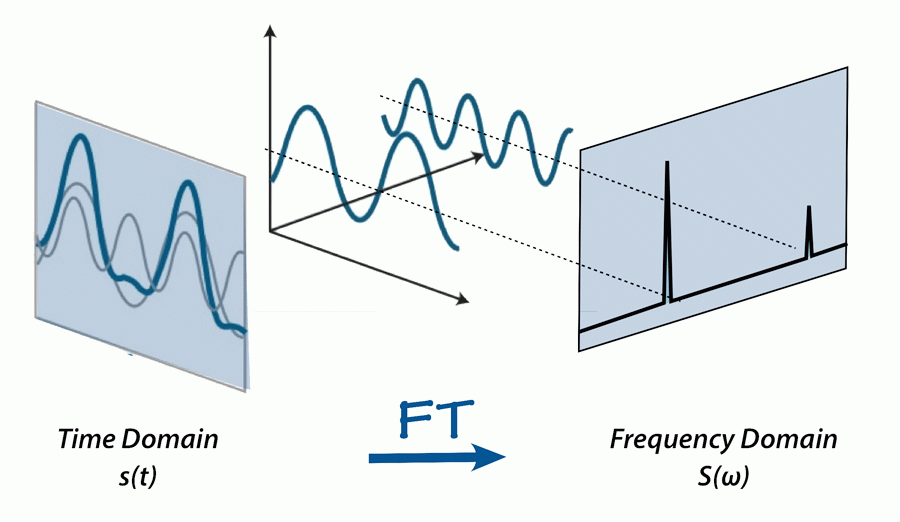

# Project Objective:
1. Project is created with intection to detect/classify an audio signal if it is such as a cough or sneeze audio signal.
2. Further goal is to pipeline this to mobile applications to narrow the detection of sickness audio specificlly of a COVID19. 
3. To contribute to help gov authorities to identify the persons with probable coronavirus infection living among us.
("We should fight the Virus, not the Patient effected with virus")

# Audio Classification using Deep Learning in Python
## Let's Get Started

### Terminology to Know:

- Audio Signal Processing
- Basic ML Framework
- Bit Depth
- CNN
- Data visualization
- Digital Signal Processing
- Fast Fourier Transform
- Fliter Bank Coefficients
- Fourier Transform
- Hanning Window
- Implementation of a ML model in python
- Mel Filter Bank
- Mel Cepstrum Coefficients
- Preprocessing
- RNN
- Sampling and Sampling Frequency
- Sensors
- Short Time Fourier Transform
- Spectrogram

### Questions to ponder:
- What are different types of audio sources known?
- what are various audio file formats?
- How to read an audio file?
- what are various properties if audio files?
- How to vizualize an audio file?
- How to find Bit depth of an audio file in python?
- How to find various properties of an audio file?
- How to Extract Features from audio Files?

so on..

--- 

## Why do we hear various Sounds? What makes a sound unique/distinct?

<a href="https://www.nasa.gov/specials/X59/science-of-sound.html">&#9658;</a>
<b>When we think about sound:</b>

We often think about how loud it is (amplitude, or intensity) and its pitch (frequency).

<a href="https://courses.lumenlearning.com/physics/chapter/17-2-speed-of-sound-frequency-and-wavelength/">&#9658;</a>
In a given medium under fixed conditions, speed is constant. Hence, there is a relationship between frequency(f) and wavelength(λ); the higher the frequency, the smaller the wavelength

---

<a href="https://blog.soton.ac.uk/soundwaves/wave-basics/wavelength-frequency-relation/">&#9658;</a>
The animation above shows two acoustic longitudinal waves with two different frequencies but travelling with the same velocity. It can be seen that the wavelength is halved when the frequency is doubled.

---

<a href="http://iamtechnical.com/wave-properties-amplitude-wavelength-and-phase-angle">&#9658;</a>
An interactive animation illustrating the amplitude, wavelength and phase of a sine wave. Varying the amplitude, wavelength and phase; observe the effects on the transverse wave

---

## [<b>Sound</b> in our environment is the energy, <b>things</b> produce when they <b>vibrate</b> (move back and forth quickly)](https://www.explainthatstuff.com/sound.html)

---

# How much of Sound Intensity can we Feel? 

[
Image Follow Up
](https://www.scienceguru.co.in/fileman/Uploads/PHY%2009/Sound/electrical%20guru%20noise%20level.png)

---

# How much of Sound Frequency can we Feel? 

Image courtesy of [NASA](https://www.nasa.gov/specials/X59/science-of-sound.html) 

---

[
Image Follow-up
](http://www.libertycentral.org.uk/how-do-animals-hearing-compare-to-humans/)

---
 

## How do we record various Sounds? Can Machines distinguish audio from non-audio data?
<a href="https://www.britannica.com/technology/digital-sound-recording">&#9658;</a>
**Digital Sound Recording:** 
Method of ***preserving sound*** in which audio signals are 
`transformed` into a series of pulses that correspond to ***patterns of binary digits*** (0's and 1's)

---

## What's the science of sound ? [&#9658;](https://www.nasa.gov/specials/X59/science-of-sound.html)

[Graphic Follow Up](https://deepmind.com/blog/article/wavenet-generative-model-raw-audio)

---

<a href="https://en.wikipedia.org/wiki/Sampling_(signal_processing)">&#9658;</a>
**Signal sampling representation:**
 

1. A **sample** is a **value** or set of values **at a point** in time and/or space.
2. **Sampler** is a subsystem or operation that **extracts samples** from a continuous signal.

<b>Fig:</b> The continuous signal is represented with a green colored line while the discrete samples are indicated by the blue vertical lines.

### let s(t) be a continuous function (or "signal") to be sampled

<b>Sampling Interval or Sampling Period: </b> 
Sampling performed by measuring the value of the continuous function every T seconds

<b>Sampling Frequency or Sampling Rate: </b> 
The average number of samples obtained in one second (samples per second) 

---

## [COVID'19 Cough Audio](https://www.youtube.com/watch?v=8VA73zW2DXY) Analysis

**Patient Details:**
- Age: 49
- Sex: Male
- Country: UK
- Day: 5
- Resource Date: Mar 23, 2020
- Infection Symptoms: cannot Breathe, Heavy Coughs.
- Health Status before effected by COVID'19: Healthy Person, Regular Swimmer

---

[
 COVID19 Cough sample of a 49year old Male in UK 
]("content/COVID19_Cough_UK_49M_D5.wav")

---

# Audio Analysis of COVID-19 Cough and Breathing patterns of the patient:

---

---

<a href="https://aavos.eu/glossary/fourier-transform/">&#9658;</a>
<b>Time Domain to Frequency Domain Transformation:</b>

---

## **Signal Feature Extraction:** <a href="https://haythamfayek.com/2016/04/21/speech-processing-for-machine-learning.html">&#9658;</a>

1. Filter Banks  
2. Mel Frequency Cepstrum Coefficients 

### How to find these Coefficients?

A signal goes through a pre-emphasis filter.
1. Then gets sliced into (overlapping) frames
2. A window function is applied to each frame
3. Afterwards, we do a Fourier transform on each frame (or more specifically a Short-Time Fourier Transform) 
4. Calculate the power spectrum; 
5. And subsequently compute the filter banks. 
6. To obtain MFCCs, a Discrete Cosine Transform (DCT) is applied to the filter banks retaining a number of the resulting coefficients while the rest are discarded.

- A final step in both cases, is mean normalization.

---

---

<a href="http://practicalcryptography.com/miscellaneous/machine-learning/guide-mel-frequency-cepstral-coefficients-mfccs/">&#9658;</a>
<b>Steps used for calculating MFCCs for the COVID19 Cough audio sample:</b>
+ Slice the signal into short frames (of time)
+ Compute the periodogram estimate of the power spectrum for each frame
+ Apply the mel filterbank to the power spectra and sum the energy in each filter
+ Take the discrete cosine transform (DCT) of the log filterbank energies

---

---

## What is the difference between mono and stereo?
In **monaural sound** one single channel is used. It can be reproduced through several speakers, but all speakers are still reproducing the same copy of the signal.

In **stereophonic sound** more channels are used (typically two). You can use two different channels and make one feed one speaker and the second channel feed a second speaker (which is the most common stereo setup). 

This is used to create directionality, perspective, space.

---
# Data Description
**Dataset Source:** https://osf.io/tmkud/

**Motivation:**

This dataset has been created for the [Pfizer Digital Medicine Challenge.](https://www.cmg.org/hack-pfizer/)

1. Early detection of respiratory tract infections can lead to timely diagnosis and treatment, which can result in better outcomes and reduce the likelihood of severe complications. 

2. Respiratory sounds carry rich information that can be mined to develop automated approaches for detection of sickness behaviors like coughing and sneezing. 

3. In this challenge, we invite you to build machine learning models for automatic detection of sickness sounds by using audio recordings from open datasets. 

4. The dataset was created using audio files from [ESC-50](https://github.com/karoldvl/ESC-50) and [AudioSet](https://research.google.com/audioset/).

5. We used the open source [BMAT Annotation Tool](https://github.com/BlaiMelendezCatalan/BAT) to annotate this dataset.

## Challenge
Develop machine learning models for detection of sickness sounds (coughing and sneezing)

## Dataset
The dataset is organized as follows:

train
- sick (n=1435)
- not_sick (n=2283)

validation
- sick (n=468)
- not_sick (n=753)

test
- sick (n=642)
- not_sick (n=1012)
---

### What's the Execution Plan?
- The data is in the directory Dataset
  - further in the directories: 'Train' 'Test' and 'Validation'
- Each Set has two directories named by the dataset classes

### What's the dataset Size?
- Its Big !!!

### Is it Big Data Problem?
- Yes

### Do I have resources to use hadoop/aws?
- No, I'm in Lockdown and limited time, knowledge and internet is a concern for me!!

### What's the solution?
- Have to use my old Intel i3 core :/ laptop to devolep few basic templates

- Once I get internet access, I'll use the template to run on Google's Colab =')
- After debugging, I'll increase the full dataset and re-run the program files for visualizaton, model training :O (A possible update on this :|)
---

# Preprocessing
**Data is Cleaned and Following is the class distribution:**

 
> The above analysis explains that the dataset of both classes in the training folder is equally distributed in the length.

**The MFCC Feature Extraction is applied to every training sample to get 13x99 features/coefficients. This is the method used to convert the audio data into numpy arrays**

---

# Model Building

---

# Training Analysis

---

### It is understood that the MFCC and Spectrograms of the audio signals can also be used as image dataset and build CNN Models to classify the audio samples.

Model comparision can be made between the current RNN model, transfer learning models and the CNN Models . An update on this is in progress :P

---

# References

https://www.nasa.gov/specials/X59/science-of-sound.html

https://courses.lumenlearning.com/physics/chapter/17-2-speed-of-sound-frequency-and-wavelength/

https://blog.soton.ac.uk/soundwaves/wave-basics/wavelength-frequency-relation/

http://iamtechnical.com/wave-properties-amplitude-wavelength-and-phase-angle

https://www.explainthatstuff.com/sound.html

https://www.scienceguru.co.in/fileman/Uploads/PHY%2009/Sound/electrical%20guru%20noise%20level.png

https://www.nasa.gov/specials/X59/science-of-sound.html

http://www.libertycentral.org.uk/how-do-animals-hearing-compare-to-humans/

https://www.britannica.com/technology/digital-sound-recording

https://www.nasa.gov/specials/X59/science-of-sound.html

https://deepmind.com/blog/article/wavenet-generative-model-raw-audio

https://en.wikipedia.org/wiki/Sampling_(signal_processing)

https://www.youtube.com/watch?v=8VA73zW2DXY

https://aavos.eu/glossary/fourier-transform/

https://haythamfayek.com/2016/04/21/speech-processing-for-machine-learning.html

http://practicalcryptography.com/miscellaneous/machine-learning/guide-mel-frequency-cepstral-coefficients-mfccs/

